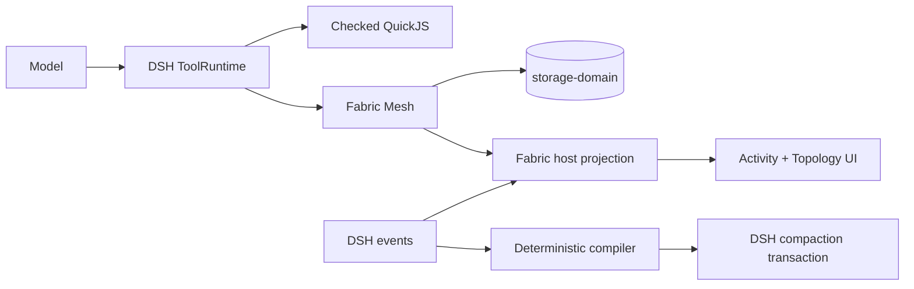

<div align="center">

# 🧵 dsh-fabric

**Fabric-style capabilities for [DeepSeek Harness](https://github.com/deepseek-ai/deepseek-harness)**

_Deterministic compaction, checked code execution, durable coordination, and live topology — delivered as native DSH plugins._

[](https://github.com/monotykamary/dsh-fabric/actions/workflows/check.yml)
[](https://github.com/deepseek-ai/deepseek-harness)
[](https://www.typescriptlang.org/)
[](LICENSE)

</div>

---

**dsh-fabric** adapts the most useful ideas from [pi-fabric](https://github.com/monotykamary/pi-fabric) to DeepSeek Harness without creating a parallel runtime. DSH ToolRuntime remains the tool and policy authority, Cordis owns component lifecycle, and Fabric adds focused providers for compaction, code execution, coordination, projections, and browser UI.

## Why Fabric?

| | Capability | What it unlocks |
| :-: | --- | --- |
| 🧠 | **Deterministic compaction** | Structured, bounded summaries without a second model request. |
| ⚡ | **Checked Code Mode** | TypeScript validation followed by isolated QuickJS execution with strict budgets. |
| 🕸️ | **Durable mesh** | Topics, compare-and-swap state, and crash-conservative actor mailboxes. |
| 📡 | **Unified activity** | Fabric, workflow, and compaction events projected into one chronological surface. |
| 🗺️ | **Live topology** | Sessions, agents, actors, topics, state, and messages in one directed graph. |
| 🧩 | **Native composition** | External DSH plugins — no second tool registry, lifecycle, or React business-state store. |

## How it fits



The installable workspace bundle masks the inherited code runtime, stock compactor/pruner, and shipped preset roster. It then mounts Fabric's QuickJS provider, deterministic compaction engine, Fabric-owned presets, mesh Consumer, host projection, and client surfaces under seven composed rows.

## Packages

| Package | Responsibility |
| --- | --- |
| [`@dsh-fabric/protocol`](packages/protocol) | Host-independent activity, topology, mesh, and actor records. |
| [`@dsh-fabric/compaction`](packages/compaction) | Deterministic summary compiler, DSH `CompactionEngine`, and masked preset roster. |
| [`@dsh-fabric/host`](packages/host) | Durable-event adapter and bounded session projection. |
| [`@dsh-fabric/mesh`](packages/mesh) | Topics, CAS state, actor mailboxes, and the `fabric_mesh` Consumer. |
| [`@dsh-fabric/code-runtime-quickjs`](packages/code-runtime-quickjs) | Checked QuickJS `CodeRuntime` provider with execution budgets. |
| [`@dsh-fabric/client-ui`](packages/client-ui) | Browser Activity, Topology, popup metrics, and subagent navigation. |

## Install

Requirements: Node.js `^22.19.0 || >=24`, pnpm 11, and DSH `0.1.0-rc.6`.

Clone the repository and install it into your local DSH `web` profile:

```bash
git clone https://github.com/monotykamary/dsh-fabric.git
cd dsh-fabric
pnpm install
pnpm run install:local
```

The installer builds all packages, links the bundle and its six packages, and validates the composed plugin graph. It **does not** start or restart DSH. The plugin graph takes effect on the next profile load.

<details>
<summary><strong>Profiles, custom DSH homes, and uninstalling</strong></summary>

```bash
# Target another profile
pnpm run install:local -- --profile tui

# Target another DSH home
DSH_HOME=/path/to/dsh-home pnpm run install:local -- --profile web

# Reuse existing build output
pnpm run install:local -- --skip-build

# Restore the exact dependency specifications that existed before install
pnpm run uninstall:local
```

Use the same `--profile` or `DSH_HOME` selection when uninstalling. Without its ownership-state file, the uninstaller refuses to remove packages unless this checkout's exact local links prove ownership.

</details>

## The `fabric_mesh` tool

One Consumer exposes durable coordination through a compact action protocol:

| Primitive | Actions | Guarantee |
| --- | --- | --- |
| **Topics** | `create_topic`, `publish`, `read_topic`, `prune_topic` | Storage-backed ordered messages with explicit retention. |
| **State** | `get_state`, `cas_state` | Revision-checked updates; revision `0` creates an absent key. |
| **Actors** | `create_actor`, `send_actor`, `read_mailbox` | Durable command queues addressed to stable actors. |
| **Claims** | `claim_actor_message`, `settle_actor_message` | Token-fenced settlement and replay-safe terminal outcomes. |
| **Discovery** | `snapshot` | Bounded metadata for rediscovering durable coordination state. |

Actor claims are deliberately crash-conservative. A claimed command stays claimed after process failure, settlement requires the opaque claim token, and retrying the same settlement returns the stored result rather than executing twice.

## Compaction and continuation

Fabric becomes the only composed compaction backend while preserving DSH's `/compact` command, durable transaction, token meter, and backend-independent invariants.

- Typed messages and lifecycle events compile into bounded **Session Goal**, **Files and Changes**, **Fabric Activity**, **Outstanding Context**, **Earlier Turns**, **Current Status**, and recent-transcript sections.
- Reasoning blocks are erased; tool calls and results remain paired by exact identity.
- Only the newest strict, provider-stamped snapshot can seed a later compaction.
- Mesh contributes bounded metadata — never arbitrary payloads — so durable identifiers can be rediscovered after compaction.
- Guidance requires rereading durable state after compaction or `TOOL_OUTCOME_UNKNOWN` instead of trusting conversational memory.

See [`ADAPTATION_SWEEP.md`](ADAPTATION_SWEEP.md) for the reuse matrix, acceptance evidence, and deferred parity surfaces.

## Client surfaces

Fabric adds a conversation tab with:

- a chronological **Activity** view for agent, workflow, mesh, and compaction events;
- a directed **Topology** view spanning sessions, actors, topics, CAS state, and routed messages;
- a compact header popup with status and metrics;
- native navigation to authoritative DSH subagent sessions.

Business state remains in DSH and storage-domain. Client-local state is limited to view selection, filters, expansion, and viewport state.

### Client HMR

Hot reload requires both watchers:

1. The DeepSeek Harness checkout serving the GUI runs `pnpm run dev:web`.
2. This workspace runs `pnpm run watch:client` to rebuild `packages/client-ui/lib/client.js`.

A running server alone does not compile this repository, and the first installation of a new profile row requires a later profile load.

## Development

```bash
pnpm install
pnpm run check
```

`pnpm run check` type-checks, builds, tests, and verifies the complete workspace. The QuickJS provider enforces fresh contexts, JSON bridge validation, deadlines, cancellation, memory/stack/output budgets, and quiescent disposal.

## Current scope

This is a focused DSH adaptation, not literal pi-fabric parity. Known constraints include:

- DSH `0.1.0-rc.6` cannot reload logs containing Fabric's required external activity event because its persisted-event allowlist is static. Live operation and detached replay work; mesh business state remains durable.
- The current DSH `CodeRunRequest` omits the generated SDK declaration prelude, so QuickJS checks namespace/member existence and normal TypeScript semantics while ToolRuntime remains the authoritative argument/result validator.
- Actor mailboxes provide durable claim/settle semantics, not an always-resident autonomous actor host.
- Fabric-owned presets are pinned adaptations of DSH `0.1.0-rc.6` and must be reviewed on host upgrades.

## Acknowledgments

- Built for [DeepSeek Harness](https://github.com/deepseek-ai/deepseek-harness).
- Adapted from ideas and implementation experience in [pi-fabric](https://github.com/monotykamary/pi-fabric).

## License

MIT © [Tom Nguyen](https://github.com/monotykamary). See [`THIRD_PARTY_NOTICES.md`](THIRD_PARTY_NOTICES.md).
