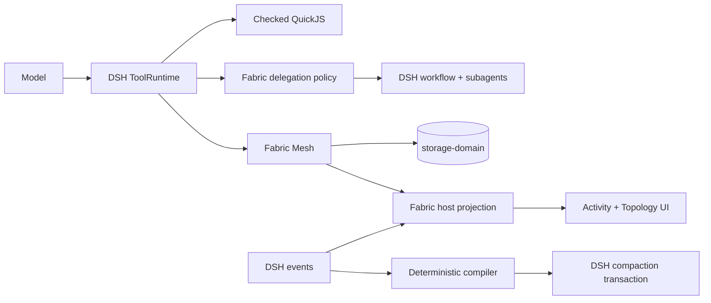

<div align="center">

# 🧵 dsh-fabric

**Fabric-style capabilities for [DeepSeek Harness](https://github.com/deepseek-ai/deepseek-harness)**

_Deterministic compaction, checked code execution, durable coordination, tier-aware delegation, and live Mission Control — delivered as native DSH plugins._

[](https://github.com/monotykamary/dsh-fabric/actions/workflows/check.yml)
[](https://github.com/deepseek-ai/deepseek-harness)
[](https://www.typescriptlang.org/)
[](LICENSE)

</div>

---

**dsh-fabric** adapts the most useful ideas from [pi-fabric](https://github.com/monotykamary/pi-fabric) to DeepSeek Harness without creating a parallel runtime. DSH ToolRuntime remains the tool and policy authority, Cordis owns component lifecycle, and Fabric adds focused providers for compaction, code execution, coordination, projections, and browser UI.

## Why Fabric?

| | Capability | What it unlocks |
| :-: | --- | --- |
| 🧠 | **Deterministic compaction** | Structured, bounded summaries without a second model request. |
| ⚡ | **Checked Code Mode** | TypeScript validation followed by isolated QuickJS execution with strict budgets. |
| 🕸️ | **Durable mesh** | Topics, compare-and-swap state, and crash-conservative actor mailboxes. |
| 🧭 | **Native delegation** | Cheap/default/strong workers over DSH workflows, with observed-route verification and bounded parallelism. |
| 📡 | **Unified activity** | Fabric, workflow, and compaction events projected into one chronological surface. |
| 🗺️ | **Live topology** | Portable participants and mesh resources in a grouped tree, with message flow kept as traffic overlays. |
| 🧩 | **Native composition** | External DSH plugins — no second tool registry, lifecycle, or React business-state store. |

## How it fits



The installable workspace bundle masks the inherited code runtime, stock compactor/pruner, and shipped preset roster. It then mounts Fabric's QuickJS provider, deterministic compaction engine, Fabric-owned presets, mesh provider, host projection, and client surfaces through the host composition. The Fabric mesh Consumer, the `fabric_models` Consumer, the `delegate` Consumer, and the Fabric system-prompt overlay are NOT host rows: they mount inside the `fabric` preset itself, so their prompt surfaces stay fabric-scoped and no other preset's system prompt is touched. The Fabric-owned roster keeps the four pinned DSH modes and adds a fifth, `fabric`: Fabric mode uses the Code Mode SDK under its own preset identity and selects `runCodeLabel: inferred`, so `code` is the only required outer argument, an explicit description still wins, and otherwise one deterministic title derived from the logged program serves the call card and compaction. Fabric sessions record and display as Fabric mode instead of reusing PTC mode.

## Packages

| Package | Responsibility |
| --- | --- |
| [`dsh-fabric-protocol`](packages/protocol) | Host-independent participant, activity, topology, mesh, and actor records. |
| [`dsh-fabric-compaction`](packages/compaction) | Deterministic summary compiler, DSH `CompactionEngine`, and masked preset roster. |
| [`dsh-fabric-host`](packages/host) | Durable-event adapter and bounded session projection. |
| [`dsh-fabric-system-prompt`](packages/system-prompt) | Fabric-owned system prompt override and native-prose minimization. |

| [`dsh-fabric-mesh`](packages/mesh) | Topics, CAS state, actor mailboxes, and the `fabric_mesh` Consumer. |
| [`dsh-fabric-models`](packages/models) | Session model inspection and alias-aware switching through the `fabric_models` Consumer. |
| [`dsh-fabric-delegation`](packages/delegation) | Tier-aware `delegate` Consumer over native DSH workflows and subagents, with observed-route verification. |
| [`dsh-fabric-schema`](packages/schema) | Schema-enforced world state, evidence digests, and fail-closed certification: `state_*` Timeline/CAS head, complexity ledger, goal predicate, and `schema_*` hypothesis → certificate → commit workspace transactions with enforce/audit modes. |
| [`dsh-fabric-code-runtime-quickjs`](packages/code-runtime-quickjs) | Checked QuickJS `CodeRuntime` provider with execution budgets. |
| [`dsh-fabric-client-ui`](packages/client-ui) | Browser Activity, Topology, popup metrics, and subagent navigation. |

## Install

Requirements: Node.js `^22.19.0 || >=24`, pnpm 11, and DSH `0.1.6`.

Clone the repository and install it into your local DSH `web` profile:

```bash
git clone https://github.com/monotykamary/dsh-fabric.git
cd dsh-fabric
pnpm install
pnpm run install:local
```

The installer builds all packages, links the bundle and its ten workspace packages, and validates the composed plugin graph. It **does not** start or restart DSH. The plugin graph takes effect on the next profile load.

<details>
<summary><strong>Profiles, custom DSH homes, and uninstalling</strong></summary>

```bash
# Target another profile
pnpm run install:local -- --profile tui

# Target another DSH home
DSH_HOME=/path/to/dsh-home pnpm run install:local -- --profile web

# Reuse existing build output
pnpm run install:local -- --skip-build

# Restore the exact dependency specifications that existed before install
pnpm run uninstall:local
```

Use the same `--profile` or `DSH_HOME` selection when uninstalling. Without its ownership-state file, the uninstaller refuses to remove packages unless this checkout's exact local links prove ownership.

</details>

## System prompt and DSH masks

Installing the bundle replaces the verbose native DSH prompt prose with a minimized Fabric operating prompt:

- A `fabric:system-prompt` section (right after the persona) captures pi-fabric's long-horizon disciplines and gives the model the exact one-off `tools.subagent({ description, prompt, provider, model })` recipe, background-first continuable lifecycle, fresh-versus-fork choice, durable `fabric_mesh` coordination, deterministic compaction recovery, Code-Mode economy, delegation fan-out, and error recovery.
- A preset-scoped `fabric:delegation` section and always-visible `delegate` schema give Main a low-friction coordinator path without adding a planning-model call. Mechanical work maps to cheap workers; independent tasks launch together; Main must inspect `routingVerified` and verify material claims.
- A `system-prompt/assemble` waterfall listener drops redundant native per-tool guidance while preserving the persona, trusted `user:system-instructions`, plan policy, reporting, Code-Mode SDK/collapse sections, memory, and mesh guidance. DSH ToolRuntime supplies run-scoped `tools.describe`/`tools.call`; the minimized SDK retains those declarations while hiding optional tool entries.
- DSH's todo ledger and goal system (`todo_write`, `create_goal`/`get_goal`/`update_goal`, `/goal`, the goal round driver, and the goal bar) are masked. Long-horizon objectives and progress belong in `fabric_mesh` instead of same-session todo/goal records.
- Fabric memory/recall composes DSH's native session-query tools (`session_search`, `session_event_search`, and the `session_trace`/`session_event_trace`/`session_event_read` readers) over a durable SQLite FTS5 index, with `fabric:memory-guidance` prompt guidance for re-establishing dropped context after `/compact`.
- The standard, code, fabric, and cordis presets expose `/delegate [--provider <id> --model <id>] [--fork] <task>` through the ordinary slash-command UI, starting one background child without a parent model turn.

## The `fabric_mesh` tool

One Consumer exposes durable coordination through a compact action protocol:

| Primitive | Actions | Guarantee |
| --- | --- | --- |
| **Topics** | `create_topic`, `publish`, `read_topic`, `prune_topic` | Storage-backed ordered messages with explicit retention. |
| **State** | `get_state`, `cas_state` | Revision-checked updates; revision `0` creates an absent key. |
| **Actors** | `create_actor`, `send_actor`, `read_mailbox` | Durable command queues addressed to stable actors. |
| **Claims** | `claim_actor_message`, `settle_actor_message` | Token-fenced settlement and replay-safe terminal outcomes. |
| **Discovery** | `snapshot` | Bounded metadata for rediscovering durable coordination state. |

Actor claims are deliberately crash-conservative. A claimed command stays claimed after process failure, settlement requires the opaque claim token, and retrying the same settlement returns the stored result rather than executing twice.

Mesh records are isolated by one workspace identity shared by prompt assembly and tool execution: registered workspace membership or canonical path ownership takes precedence, followed by an unregistered path digest and finally a session-only scope when no `cwd` exists.

## Compaction and continuation

Fabric becomes the only composed compaction backend while preserving DSH's `/compact` command, durable transaction, token meter, and backend-independent invariants.

- Typed messages and lifecycle events compile into bounded **Session Goal**, **Files and Changes**, **Fabric Activity**, **Outstanding Context**, **Earlier Turns**, **Current Status**, and recent-transcript sections.
- Reasoning blocks are erased; tool calls and results remain paired by exact identity.
- Each compaction reconstructs cumulative facts from immutable source-event citations instead of recursively trusting prior checkpoint prose; strict snapshots remain bounded diagnostic and detached-caller artifacts. A 100,000-event traversal cap degrades with an explicit omission notice rather than permanently failing `/compact`.
- Mesh contributes bounded metadata — never arbitrary payloads — so durable identifiers can be rediscovered after compaction.
- Guidance requires rereading durable state after compaction or `TOOL_OUTCOME_UNKNOWN` instead of trusting conversational memory.

See [`ADAPTATION_SWEEP.md`](ADAPTATION_SWEEP.md) for the reuse matrix, acceptance evidence, and deferred parity surfaces.

## Client surfaces

Fabric adds a conversation tab with:

- a **Workers** Mission Control view for delegation groups, running-first workers, tier/model routes, elapsed time, usage, output/errors, parent/child relationship, current activity, and authoritative open/cancel/message/steer/continue-after-failure controls;
- a chronological **Activity** view for agent, workflow, mesh, and compaction events;
- a left-to-right **Topology** tree: `Main → Participants → {Sessions, Agents, Actors}` and `Main → Mesh → {Topics, State}`;
- dashed traffic overlays for topic publication, actor routing, and state access rather than message nodes in the hierarchy;
- deterministic arrow-key or H/J/K/L navigation with focus-aware scrolling;
- native navigation to authoritative DSH sessions.

Delegation configuration lives on the `dsh-fabric-delegation` preset row: `mainModel`, `cheapModel`, `defaultModel`, `strongModel`, `validatorModel`, `aliases`, `maxParallelWorkers`, `maxWorkersPerDelegation` (hard-capped at 20), `maxDelegationDepth` (default 1), optional `tokenBudget`, and `autoPolicy` (`off`, `suggest`, or `prefer`). See [`packages/delegation/README.md`](packages/delegation/README.md) and [`docs/delegation/`](docs/delegation/) for architecture, evaluation, and screenshot evidence.

`FabricParticipantRecord` is the portable semantic identity used by the UI. The DSH session mirror and Fabric actor records remain lifecycle authorities; the adapter does not introduce a second executor, registry, or client business-state store. Workflow, phase, message, and compaction facts remain available in Activity without crowding the topology.

Business state remains in DSH and storage-domain. Client-local state is limited to view selection, filters, expansion, and viewport state.

### Client HMR

Hot reload requires both watchers:

1. The DeepSeek Harness checkout serving the GUI runs `pnpm run dev:web`.
2. This workspace runs `pnpm run watch:client` to rebuild `packages/client-ui/lib/client.js`.

A running server alone does not compile this repository, and the first installation of a new profile row requires a later profile load.

## Development

```bash
pnpm install
pnpm run check
```

`pnpm run check` type-checks, builds, tests, and verifies the complete workspace. The QuickJS provider enforces fresh contexts, JSON bridge validation, deadlines, cancellation, memory/stack/output budgets, and quiescent disposal.

## Current scope

This is a focused DSH adaptation, not literal pi-fabric parity. Known constraints include:

- New mesh activity uses DSH-native `tool/result.meta` and `tool/code-dispatch` events. Only legacy logs written with the retired required `fabric/activity` event remain incompatible with DSH `0.1.0-rc.6`'s static persisted-event allowlist.
- Mesh records written before workspace scoping remain stored but are deliberately invisible to workspace-bound reads; automatic migration would guess an ambiguous destination, so any re-key must be an explicit operator action.
- The current DSH `CodeRunRequest` omits the generated SDK declaration prelude, so QuickJS checks namespace/member existence and normal TypeScript semantics while ToolRuntime remains the authoritative argument/result validator.
- Actor mailboxes provide durable claim/settle semantics, not an always-resident autonomous actor host.
- Fabric-owned presets are pinned adaptations of DSH `0.1.0-rc.6` and must be reviewed on host upgrades.
- Memory/recall is DSH session-query composed into the `fabric` preset, not pi-fabric's tiered transcript index: regex query mode, pi's Fabric-operation filters, and a session-list browse tool are not ported.

## Acknowledgments

- Built for [DeepSeek Harness](https://github.com/deepseek-ai/deepseek-harness).
- Adapted from ideas and implementation experience in [pi-fabric](https://github.com/monotykamary/pi-fabric).

## License

MIT © [Tom Nguyen](https://github.com/monotykamary). See [`THIRD_PARTY_NOTICES.md`](THIRD_PARTY_NOTICES.md).
